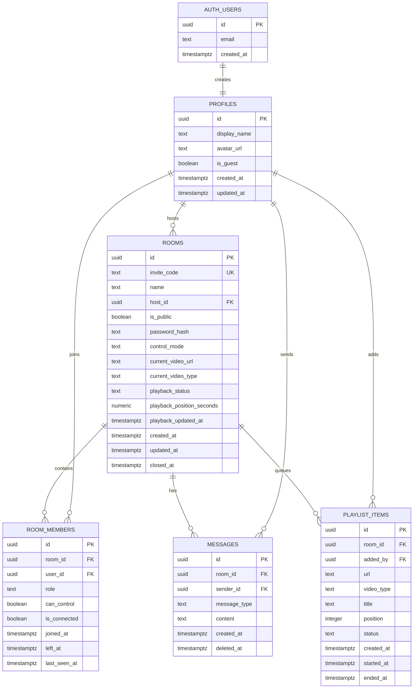

# المرحلة 1: هيكل المشروع ومخطط قاعدة البيانات

هذا الملف يثبت قرارات المرحلة الأولى فقط: بنية الحزم والمجلدات، ومخطط قاعدة البيانات على مستوى التصميم. سيتم إنشاء ملف `schema.sql` الكامل في المرحلة الثانية كما طلبت.

## 1. قرارات تصميمية مختصرة

- اعتمدت **Package by Feature** بدل التقسيم الطبقي العام فقط، لأن ميزات المشروع مستقلة نسبيًا: غرف، أعضاء، دردشة، قائمة انتظار، WebSocket، و WebRTC. هذا يجعل الصلاحيات والمنطق الخاص بكل ميزة أوضح وأسهل في الاختبار.
- سيتم الاعتماد على **Supabase Auth JWT** كهوية موحدة للمستخدمين المسجلين والضيوف. دخول الضيف سيُنفّذ لاحقًا كجلسة مجهولة/مؤقتة عبر Supabase Auth حتى يبقى REST و WebSocket مبنيين على JWT واحد.
- واجهة HTML/CSS/JS ستوضع داخل `src/main/resources/static` ليخدمها Spring Boot مباشرة بدون React أو build tool إضافي. هذا يبسط النشر على Render/Railway ويقلل نقاط الفشل.
- ملف SQL النهائي سيبقى في `supabase/schema.sql` حتى يمكن نسخه مباشرة إلى Supabase SQL Editor. مجلد `src/main/resources/db` محجوز لأي سكربتات فحص/تهيئة محلية لاحقة إن احتجناها.

## 2. هيكل المشروع المعتمد

```text
Watch-party/
├── docs/
│   └── 01-project-structure-and-db-plan.md
├── supabase/
│   └── schema.sql                       # المرحلة 2
├── src/
│   ├── main/
│   │   ├── java/
│   │   │   └── com/
│   │   │       └── watchparty/
│   │   │           ├── WatchPartyApplication.java      # المرحلة 3
│   │   │           ├── auth/
│   │   │           │   ├── controller/
│   │   │           │   ├── dto/
│   │   │           │   └── service/
│   │   │           ├── common/
│   │   │           │   ├── dto/
│   │   │           │   ├── exception/
│   │   │           │   └── validation/
│   │   │           ├── config/
│   │   │           ├── member/
│   │   │           │   ├── dto/
│   │   │           │   ├── entity/
│   │   │           │   ├── repository/
│   │   │           │   └── service/
│   │   │           ├── message/
│   │   │           │   ├── dto/
│   │   │           │   ├── entity/
│   │   │           │   ├── repository/
│   │   │           │   └── service/
│   │   │           ├── playlist/
│   │   │           │   ├── controller/
│   │   │           │   ├── dto/
│   │   │           │   ├── entity/
│   │   │           │   ├── repository/
│   │   │           │   └── service/
│   │   │           ├── profile/
│   │   │           │   ├── controller/
│   │   │           │   ├── dto/
│   │   │           │   ├── entity/
│   │   │           │   ├── repository/
│   │   │           │   └── service/
│   │   │           ├── realtime/
│   │   │           │   ├── config/
│   │   │           │   ├── controller/
│   │   │           │   ├── dto/
│   │   │           │   └── service/
│   │   │           ├── room/
│   │   │           │   ├── controller/
│   │   │           │   ├── dto/
│   │   │           │   ├── entity/
│   │   │           │   ├── repository/
│   │   │           │   └── service/
│   │   │           ├── security/
│   │   │           └── webrtc/
│   │   │               ├── dto/
│   │   │               └── service/
│   │   └── resources/
│   │       ├── db/
│   │       └── static/
│   │           ├── index.html            # المرحلة 8
│   │           ├── login.html            # المرحلة 8
│   │           ├── room.html             # المرحلة 8
│   │           └── assets/
│   │               ├── css/
│   │               ├── images/
│   │               └── js/
│   └── test/
│       └── java/
│           └── com/
│               └── watchparty/
└── pom.xml                               # المرحلة 3
```

## 3. مسؤولية كل حزمة

| الحزمة | المسؤولية |
|---|---|
| `auth` | طبقة مساعدة لتسجيل/دخول Supabase من الواجهة، وربط الضيف بملف Profile عند الحاجة. |
| `security` | التحقق من Supabase JWT، استخراج `userId`، تأمين REST و WebSocket handshake. |
| `config` | إعدادات عامة مثل CORS، Jackson، خصائص Supabase، وإعدادات STUN/TURN. |
| `profile` | ملف المستخدم: الاسم الظاهر، الصورة، وحالة الضيف. |
| `room` | إنشاء الغرف، رابط الدعوة، كلمة السر، حالة الفيديو، وصلاحيات المضيف. |
| `member` | عضوية المستخدم داخل الغرفة، الدور، الاتصال الحالي، ومن يملك التحكم بالتشغيل. |
| `message` | سجل الدردشة، رسائل النظام، آخر 50 رسالة، وتنظيف المحتوى من XSS. |
| `playlist` | قائمة انتظار الفيديوهات، الترتيب، تشغيل التالي تلقائيًا. |
| `realtime` | STOMP/WebSocket، رسائل المزامنة، بث الانضمام/الخروج والدردشة. |
| `webrtc` | رسائل signaling فقط: offer/answer/ice-candidate، بدون تمرير الفيديو عبر الخادم. |
| `common` | DTOs مشتركة، أخطاء موحدة، أدوات تحقق وتنظيف مدخلات. |

## 4. مخطط قاعدة البيانات على مستوى التصميم

> هذا مخطط تصميمي وليس SQL نهائيًا. ملف SQL الكامل مع الفهارس و RLS والـ Trigger سيكون في المرحلة الثانية.



## 5. الجداول المقترحة

### 5.1 `profiles`

ملف ممتد لكل مستخدم في `auth.users`.

| العمود | النوع | ملاحظات |
|---|---|---|
| `id` | `uuid` | المفتاح الأساسي، ومرجع إلى `auth.users(id)` مع حذف متسلسل. |
| `display_name` | `text` | الاسم الظاهر؛ مطلوب بعد التنظيف. |
| `avatar_url` | `text` | اختياري. |
| `is_guest` | `boolean` | يميز الضيوف/الحسابات المؤقتة. |
| `created_at` | `timestamptz` | وقت الإنشاء. |
| `updated_at` | `timestamptz` | يتحدث تلقائيًا عبر Trigger. |

### 5.2 `rooms`

يمثل غرفة مشاهدة واحدة.

| العمود | النوع | ملاحظات |
|---|---|---|
| `id` | `uuid` | المفتاح الأساسي. |
| `invite_code` | `text` | كود قصير فريد للرابط. |
| `name` | `text` | اسم الغرفة. |
| `host_id` | `uuid` | المضيف الحالي، مرجع إلى `profiles(id)`. |
| `is_public` | `boolean` | عامة أو خاصة. |
| `password_hash` | `text` | موجود فقط للغرف المحمية؛ لا نخزن كلمة السر الخام. |
| `control_mode` | `text` | مثل: `HOST_ONLY`, `MEMBERS_WITH_PERMISSION`, `EVERYONE`. |
| `current_video_url` | `text` | رابط YouTube أو MP4 الحالي. |
| `current_video_type` | `text` | `YOUTUBE` أو `MP4`. |
| `playback_status` | `text` | `PLAYING` أو `PAUSED`. |
| `playback_position_seconds` | `numeric` | آخر موضع معروف بالثواني. |
| `playback_updated_at` | `timestamptz` | وقت آخر تحديث للمزامنة. |
| `created_at` / `updated_at` / `closed_at` | `timestamptz` | إدارة دورة حياة الغرفة. |

### 5.3 `room_members`

يمثل وجود مستخدم داخل غرفة وصلاحياته.

| العمود | النوع | ملاحظات |
|---|---|---|
| `id` | `uuid` | المفتاح الأساسي. |
| `room_id` | `uuid` | مرجع إلى `rooms(id)`. |
| `user_id` | `uuid` | مرجع إلى `profiles(id)`. |
| `role` | `text` | `HOST`, `MEMBER`. يمكن توسيعه لاحقًا إلى `MODERATOR`. |
| `can_control` | `boolean` | يسمح بالتحكم بالتشغيل إذا كان `control_mode` يتطلب إذنًا. |
| `is_connected` | `boolean` | حالة اتصال WebSocket الحالية. |
| `joined_at` / `left_at` / `last_seen_at` | `timestamptz` | تتبع الحضور والخروج. |

### 5.4 `messages`

رسائل الدردشة ورسائل النظام.

| العمود | النوع | ملاحظات |
|---|---|---|
| `id` | `uuid` | المفتاح الأساسي. |
| `room_id` | `uuid` | الغرفة. |
| `sender_id` | `uuid` | المرسل، وقد يكون ضيفًا عبر Profile مؤقت. |
| `message_type` | `text` | `CHAT`, `EMOJI`, `SYSTEM`. |
| `content` | `text` | نص منظف ومحدد الطول. |
| `created_at` | `timestamptz` | للفرز وجلب آخر 50 رسالة. |
| `deleted_at` | `timestamptz` | حذف منطقي إن احتجنا للإدارة. |

### 5.5 `playlist_items`

قائمة انتظار الفيديوهات لكل غرفة.

| العمود | النوع | ملاحظات |
|---|---|---|
| `id` | `uuid` | المفتاح الأساسي. |
| `room_id` | `uuid` | الغرفة. |
| `added_by` | `uuid` | من أضاف الفيديو. |
| `url` | `text` | رابط YouTube أو MP4. |
| `video_type` | `text` | `YOUTUBE` أو `MP4`. |
| `title` | `text` | عنوان اختياري أو مستخرج من الرابط. |
| `position` | `integer` | ترتيب العنصر داخل الغرفة. |
| `status` | `text` | `QUEUED`, `PLAYING`, `PLAYED`, `SKIPPED`. |
| `created_at` / `started_at` / `ended_at` | `timestamptz` | إدارة حالة التشغيل. |

## 6. العلاقات والقيود المهمة

- `profiles.id` يساوي `auth.users.id` حتى لا نحتاج جدول حسابات منفصل.
- `rooms.host_id` يشير دائمًا إلى عضو موجود في `profiles`، وسيتم التأكد في الخدمة أن المضيف عضو في نفس الغرفة.
- `room_members` سيحتوي قيدًا فريدًا على `(room_id, user_id)` لمنع تكرار العضوية.
- `playlist_items` سيحتوي قيدًا فريدًا على `(room_id, position)` للحفاظ على ترتيب قائمة الانتظار.
- سيتم تقييد أنواع الحقول النصية المهمة بقيود `CHECK` في المرحلة الثانية بدل إنشاء PostgreSQL enums لتسهيل التعديلات المستقبلية.

## 7. الفهارس المخططة

| الفهرس | الهدف |
|---|---|
| `rooms(invite_code)` | فتح رابط الدعوة بسرعة. |
| `rooms(host_id)` | جلب غرف المضيف. |
| `room_members(room_id, user_id)` | التحقق من العضوية والصلاحيات. |
| `room_members(room_id, is_connected)` | قائمة المتصلين حاليًا. |
| `messages(room_id, created_at desc)` | جلب آخر 50 رسالة بسرعة. |
| `playlist_items(room_id, position)` | عرض وتشغيل قائمة الانتظار بالترتيب. |
| `playlist_items(room_id, status, position)` | إيجاد الفيديو التالي تلقائيًا. |

## 8. RLS Policies المخططة

| الجدول | سياسة القراءة | سياسة الكتابة/التعديل |
|---|---|---|
| `profiles` | المستخدم يقرأ ملفه، وأعضاء الغرفة يمكنهم قراءة ملفات أعضاء نفس الغرفة. | المستخدم يحدّث ملفه فقط. |
| `rooms` | العضو يقرأ غرفته فقط، والمضيف يقرأ غرفته فور إنشائها. | المضيف فقط يعدّل إعدادات الغرفة أو ينقل الإدارة. |
| `room_members` | عضو الغرفة يقرأ أعضاء نفس الغرفة. | الانضمام للمستخدم نفسه، والطرد/تغيير الصلاحيات للمضيف فقط. |
| `messages` | عضو الغرفة يقرأ رسائل غرفته. | عضو الغرفة يرسل رسائل لنفسه فقط، والحذف الإداري لاحقًا للمضيف. |
| `playlist_items` | عضو الغرفة يقرأ قائمة الانتظار. | الإضافة حسب صلاحية التحكم، والتعديل/الحذف للمضيف أو صاحب الإذن. |

## 9. Triggers المخططة

- Trigger على `auth.users` لإنشاء صف تلقائي في `profiles` عند التسجيل أو الدخول كضيف.
- Trigger عام لتحديث `updated_at` عند تعديل `profiles` و `rooms`.
- Trigger أو قيد خدمة لضمان أن `rooms.host_id` عضو فعلي في `room_members` بعد إنشاء الغرفة.

## 10. ملاحظات Supabase والأسرار

- لن يتم حفظ `DB password` أو `JWT secret` أو مفاتيح حساسة داخل الكود أو المستودع.
- سيتم استخدام متغيرات بيئة لاحقًا مثل: `SUPABASE_URL`, `SUPABASE_ANON_KEY`, `SUPABASE_JWT_SECRET`, `SPRING_DATASOURCE_URL`, `SPRING_DATASOURCE_USERNAME`, `SPRING_DATASOURCE_PASSWORD`.
- اتصال قاعدة البيانات سيكون عبر Supabase Connection Pooler مع `sslmode=require` عند إضافة `application.properties` في المرحلة الثالثة.
